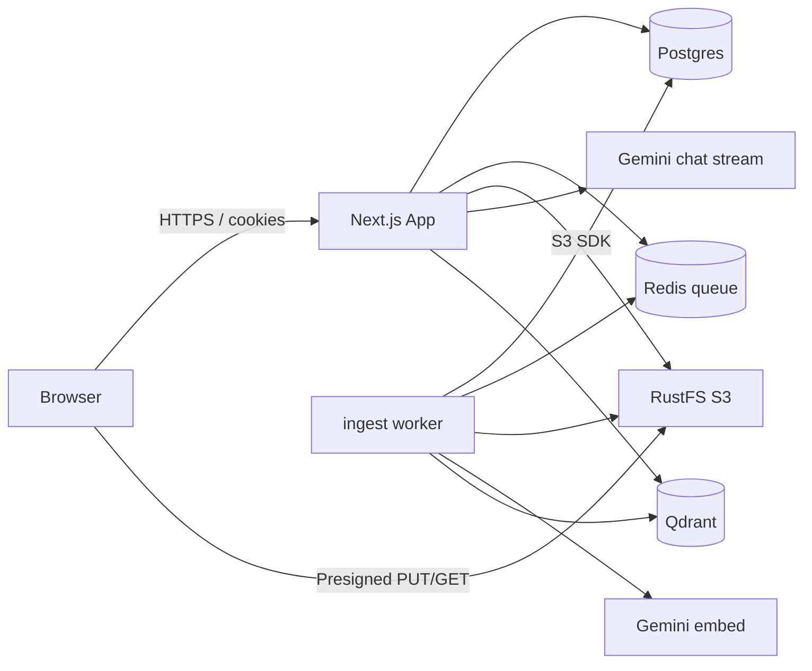

## Context

Documind is a **Next.js 16 App Router** monolith: UI, Route Handlers, and server-side integrations in one deployable app. Stateful dependencies run via Docker Compose. A **separate Node worker** runs document ingest (extract → embed → Qdrant).

## Diagram

## Layers

| Layer | Location | Responsibility |
|-------|----------|----------------|
| Marketing UI | `app/page.tsx`, marketing components | Public landing |
| App shell | `app/(app)/*` | Auth layout, sidebar, chat, documents |
| API | `app/api/*` | Auth, chats (incl. stream), documents, redis |
| Domain helpers | `lib/*` | Chats, documents, S3, Redis, ingest, RAG, Gemini, Qdrant |
| Worker | `scripts/ingest-worker.ts` | Long-running job loop |
| Schema | `db/*` | Drizzle models |
| UI primitives | `components/ui/*` | shadcn |

## Design principles

1. **Owner-scoped data** — every query filters `userId`; Qdrant search does too  
2. **Fast uploads** — browser talks to object storage with presigned URLs  
3. **No heavy work on the upload request path** — extract/embed in the worker (ADR-0007)  
4. **Retrieval before generation** — chat embeds the query, searches Qdrant, then streams Gemini  
5. **Controlled context** — only **indexed** documents **attached on the current turn**  
6. **Docker-local infra** — Postgres, Redis, RustFS, Qdrant  

## Request vs worker vs chat

| Path | Work allowed |
|------|----------------|
| Presign / confirm upload | Validate type/size, HEAD object, enqueue job |
| Compose `ingest-worker` | Download, extract (text/PDF), embed, Qdrant upsert |
| Compose `pdf-extract` | PDF → plain text (PyMuPDF) |
| Chat stream API | Embed query, retrieve, stream LLM, save message |

## Related

- [RAG chat guide](/docs/guide/rag-chat)  
- [Document ingest](/docs/guide/document-ingest)  
- [API reference](/docs/architecture/api)  
- [ADR-0008](/docs/adr/0008-gemini-streaming-rag)  
