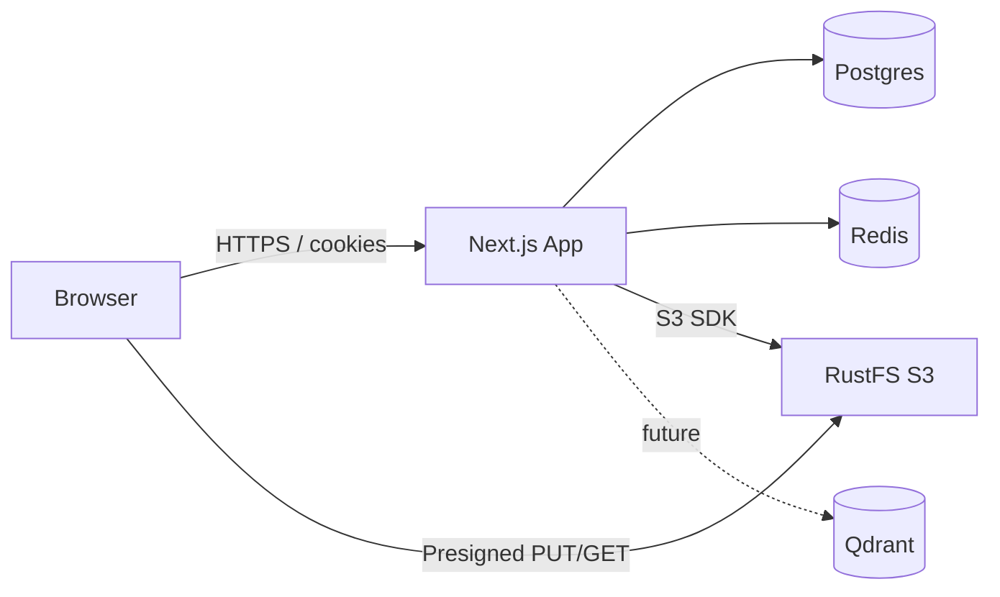

## Context

Documind is a **Next.js 16 App Router** monolith: UI, Route Handlers, and server-side integrations in one deployable app. Stateful dependencies run via Docker Compose.

## Diagram

## Layers

| Layer | Location | Responsibility |
|-------|----------|----------------|
| Marketing UI | `app/page.tsx`, marketing components | Public landing |
| App shell | `app/(app)/*` | Auth layout, sidebar, chat, documents |
| API | `app/api/*` | Auth, chats, documents, redis |
| Domain helpers | `lib/*` | Chats, documents, S3, Redis, session |
| Schema | `db/*` | Drizzle models |
| UI primitives | `components/ui/*` | shadcn |

## Design principles

1. **Owner-scoped data** — every query joins/filters `userId`  
2. **Fast uploads** — browser talks to object storage with presigned URLs  
3. **No heavy work on request path** — parsing/RAG deferred to future workers  
4. **Docker-local infra** — Postgres, Redis, RustFS, Qdrant  
