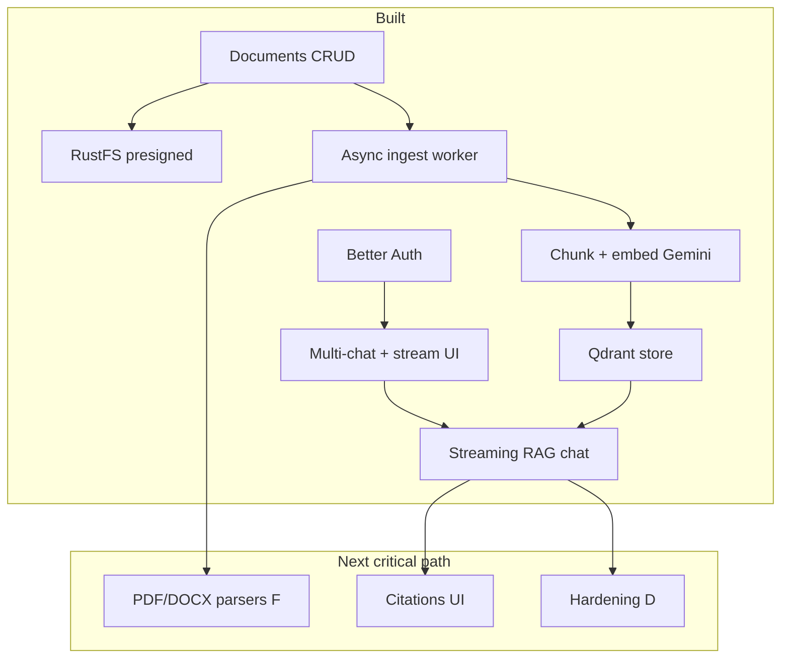

# Documind roadmap (app-focused)

This plan is for the **Documind application** (`../documind`), not this docs site. Use it to decide the next engineering investment.

**How to use this page:** pick an option ID under [Choose what to do next](#choose-what-to-do-next) (e.g. `F`, `D`, `E`) and implement that slice.

---

## 1. Product north star

**Documind** should become: *upload text documents → ask questions grounded in those documents → keep multi-chat history with ownership and durable storage.*

### Where we are now

We have the **shell + storage + multi-chat UX**, plus a **real RAG path for text files**:

- Upload → async ingest → embeddings in Qdrant  
- Chat streams Gemini answers grounded in **indexed** docs **attached on that turn**



---

## 2. Current system (as-is)

| Area | Status | Notes |
|------|--------|--------|
| Marketing + theme | Done | Landing, dark/light |
| Auth (email/password) | Done | Better Auth + Postgres |
| Multi-chat | Done | `/new`, `/c/[id]`, rename, delete |
| Chat messages | **Done (B2/B3)** | Stream Gemini RAG; persist after stream |
| Document upload | Done | Chat + My documents; allow-list |
| Document ownership | Done | Owner-only APIs |
| RustFS (S3) | Done | Presign PUT/GET/DELETE |
| Redis | Queue + demo | Ingest job list + `/redis` playground |
| Qdrant | **In use** | Chunk vectors; filtered search |
| Document ingest pipeline | **A + B2** | Jobs, worker, extract/embed for text |
| Document parsing | **Text + text PDF** | txt/md/csv + PyMuPDF; OCR / DOCX open |
| RAG / embeddings | **Done (B2)** | Gemini embed + Qdrant |
| LLM integration | **Done (B3)** | Streaming chat APIs + UI |
| Production hardening | Thin | Secrets, rate limits, observability |
| Dashboard (`/dashboard`) | Legacy | shadcn demo; not core product |

### Data already modeled

- Auth tables, `documents`, `chats`, `chat_messages`, `chat_message_documents`, `document_jobs`
- Document statuses: `pending` | `ready` | `processing` | `indexed` | `failed`

### Infra (Docker)

Postgres, Redis, RustFS, Qdrant, **pdf-extract**, **ingest-worker** via Compose. App needs **`GEMINI_API_KEY`** and `docker compose up -d`.

---

## 3. Architectural principles (keep these)

1. **Upload stays fast** — never parse large PDFs inside the Next request that handles browser upload.  
2. **Owner isolation** — every read/write filters `userId`; Qdrant search filters `userId` too.  
3. **Async ingestion** — Redis queue + worker for extract → chunk → embed.  
4. **Retrieval before generation** — answers use Qdrant with `userId` + attached `documentId`s.  
5. **Honest eligibility** — only **`indexed`** docs contribute context; UI library lists those.  
6. **Docs stay separate** — product code in `documind`; docs in `documind-docs`.  
7. **ADRs for big choices** — model provider, retrieval scope, worker language for PDF.

---

## 4. Target architecture (implemented core)

```text
Browser
  → Next.js (UI + thin APIs)
      → Postgres (users, chats, documents, jobs metadata)
      → RustFS (bytes)
      → Redis (ingest job queue)
      → Gemini (embed query + stream answer)
      → Qdrant (filtered vector search)
  → (presigned) RustFS upload/download

Worker (Compose ingest-worker)
  → pop job
  → GET object from RustFS
  → parse txt/md/csv (Node) or PDF (pdf-extract / PyMuPDF)
  → chunk
  → embed (Gemini)
  → upsert Qdrant points { userId, documentId, chunkIndex, text }

Chat send (stream routes)
  → persist user message
  → embed query
  → Qdrant search (filter userId + this-turn documentIds, indexed only)
  → stream LLM tokens
  → persist assistant message
```

Document statuses:

| Status | Meaning |
|--------|---------|
| `pending` | Presign created / upload not confirmed |
| `ready` | Object in RustFS confirmed (brief; then enqueue) |
| `processing` | Ingest job queued or running |
| `indexed` | Ingest succeeded (vectors if text-extractable) |
| `failed` | Upload or ingest failed (store reason; retriable) |

---

## 5. What we shipped recently — and why

### Option A — Ingest foundation ✅

**What:** `document_jobs`, Redis queue, Docker **`ingest-worker`**, statuses, My documents badges, retry.

**Why:** Upload must stay fast (ADR-0007). Heavy work needs a separate process, retries, and visible lifecycle before any “smart” features.

**Guide:** [Document ingest](/docs/guide/document-ingest)

### Options B2 + B3 — Text RAG + streaming ✅

**What:**

- Worker: extract → chunk → Gemini embeddings → Qdrant  
- Chat: `POST /api/chats/stream` and `.../messages/stream`  
- Product rules: **indexed-only**, **attached-on-this-turn-only**  
- UI: live tokens, library = indexed docs  

**Why (short):**

| Choice | Rationale |
|--------|-----------|
| Gemini free tier | Zero-cost MVP for embed + chat; swappable later |
| Qdrant | Already in Compose; semantic search + ownership filters |
| Text parsers first | Prove full loop without PDF complexity |
| Indexed-only | Don’t pretend unprocessed files are usable |
| Per-turn attachments | User controls context; no silent library-wide search |
| Ship streaming with RAG | Demo-quality UX; avoid “spinner then dump” |

**Guides:** [RAG chat (B2+B3)](/docs/guide/rag-chat) · [Embeddings & Qdrant](/docs/guide/embeddings-and-qdrant) · [ADR-0008](/docs/adr/0008-gemini-streaming-rag) · [ADR-0009](/docs/adr/0009-gemini-interactions-embedding-2)

### Gemini 2026 stack ✅

**What:** Interactions API chat (`gemini-3.1-flash-lite`), `gemini-embedding-2` vectors, removed legacy `generateContent` SDK.

**Why:** Google’s recommended front door for new work; old embed model shut down.

**Operator note:** After this change, **re-ingest** documents so Qdrant holds vectors from the new embed model.

---

## 6. Work backlog (remaining)

### P0 — Correctness & product clarity

| ID | Item | Why |
|----|------|-----|
| P0.1 | Remove or hide legacy **Dashboard** | Reduces confusion |
| P0.3 | Rate-limit / harden presign + chat stream | Abuse protection before public deploy |
| P0.4 | Production env checklist (secrets, HTTPS, CORS, Redis AUTH) | Local compose ≠ production |

### P1 — Document intelligence (next)

| ID | Item | Why | Status |
|----|------|-----|--------|
| P1.1–P1.2 | Job model + worker | Foundation | **Done (A)** |
| P1.3 | Parsers (text + text PDF) | Unlock content | **F1 done; OCR/DOCX open** |
| P1.4–P1.5 | Chunk + Qdrant + embeddings | RAG store | **Done (B2)** |
| P1.6 | Chat RAG + LLM stream | Product value | **Done (B2+B3)** |
| **P1.7** | **Sources footer** (doc/chunk) | Trust | **Next polish** |
| **P1.8** | **OCR + DOCX/XLSX** | Scanned + Office | Open (**F1b** / later) |

### P2 — Chat product depth

| ID | Item | Why |
|----|------|-----|
| P2.2 | Stop / regenerate | Expected chat controls |
| P2.3 | Optional “all my indexed docs” scope | Power users (opt-in) |
| P2.4 | Soft-delete / archive chats | Safer history |
| P2.5 | Editable profile name | Account completeness |

### P3 — Platform & ops

| ID | Item | Why |
|----|------|-----|
| P3.1 | App deploy + managed services | Real users |
| P3.2 | Observability (upload/ingest/RAG metrics) | Debug production |
| P3.3 | E2E tests (auth, upload, stream chat) | Regression safety |
| P3.4 | Optional malware scan for uploads | Enterprise readiness |

### P4 — Explicit non-goals (for now)

- Real-time multiplayer editing of documents  
- Image/video as primary knowledge sources  
- Parsing on the hot upload path  
- Building a general-purpose LLM playground unrelated to documents  

---

## 7. Choose what to do next

Pick **one** option and implement that slice end-to-end before starting another.

### Option A — **Ingest foundation** ✅ Done

See [Document ingest](/docs/guide/document-ingest).

### Option B2 — **Text RAG MVP** ✅ Done

Parse txt/md/csv + embed + Qdrant + retrieve on chat.

### Option B3 — **Streaming LLM** ✅ Done (with B2)

Stream Gemini over plain-text responses; UI live bubbles.

### Option C — **LLM chat only (no RAG)** — not recommended now

Would ignore document bytes. Superseded by B2/B3 for Documind’s north star.

### Option D — **Production hardening** (recommended soon)

**Ship:** env validation, rate limits, Redis AUTH for non-local, S3 production config, gate Redis demo, deploy app.

**Exit criteria:** checklist-based production deploy of current features.

### Option E — **UX polish**

**Ship:** better empty states, dashboard removal, document search filter, mobile sidebar, profile edit, citation chips.

### Option F — **PDF-capable ingest**

- **F1 (done):** text-based PDF via Docker **pdf-extract** (PyMuPDF) + Compose **ingest-worker**  
- **F1b (next engineering):** OCR (`ocr=auto`) for scanned PDFs in the same service  
- **Later:** DOCX/XLSX  

**Exit criteria F1:** text PDF → `indexed` with chunks → chat Q&A — **met**.

### Option G — **Docs / ops only**

Publish `documind-docs` to Vercel; keep app backlog frozen.

---

## 8. Decision matrix (quick)

| If you want… | Choose |
|--------------|--------|
| Better scanned PDFs | **F1b (OCR)** |
| Trust / “which source?” | **Sources footer** |
| Ship current product safely | **D** |
| Trust / polish (citations, layout) | **E** (+ P1.7) |
| Public documentation hosting | **G** |

**Architect recommendation now:**  
**F → D**, with **E**/citations interleaved as small PRs.

Historical path that got us here: **A → B2 → B3**.

---

## 9. Definition of done for “v1 document intelligence”

- [x] Upload text docs (current allow-list)  
- [x] Async ingest; status visible  
- [x] Vectors in Qdrant with `userId` filter  
- [x] Chat uses only the user’s **selected (turn)** documents  
- [x] Placeholder assistant removed for RAG path  
- [x] Failures visible and retriable  
- [x] ADRs for model + embed provider (ADR-0008)  
- [x] Text PDF extraction (F1)  
- [ ] OCR for scanned PDFs (F1b)  
- [ ] Citation UI  
- [ ] Production hardening checklist  

---

## 10. How to request work from this plan

Reply with one of:

- ~~`Do A`~~ / ~~`Do B2`~~ / ~~`Do B3`~~ — **done**  
- `Do F1b` — OCR for scanned PDFs  
- `Do sources` — sources footer  
- `Do D` — production hardening  
- `Do E` — UX polish  
- `Do G` — deploy docs to Vercel  
- Or a custom mix, e.g. `Do F + citations`  

Work lands in the **`documind`** app repo unless the option is docs-only (**G**).

---

## 11. Related docs

- [RAG chat (B2+B3) — what & why](/docs/guide/rag-chat)  
- [Embeddings, Qdrant & Gemini stack](/docs/guide/embeddings-and-qdrant)  
- [Document ingest](/docs/guide/document-ingest)  
- [Architecture overview](/docs/architecture/overview)  
- [Chat product](/docs/product/chat)  
- [Documents product](/docs/product/documents)  
- [ADR-0007 no parse on upload](/docs/adr/0007-no-parse-on-upload)  
- [ADR-0008 Gemini streaming RAG](/docs/adr/0008-gemini-streaming-rag)  
- [ADR-0009 Interactions + embedding-2](/docs/adr/0009-gemini-interactions-embedding-2)  
- [Deploy documentation](/docs/development/deploy-docs)  
