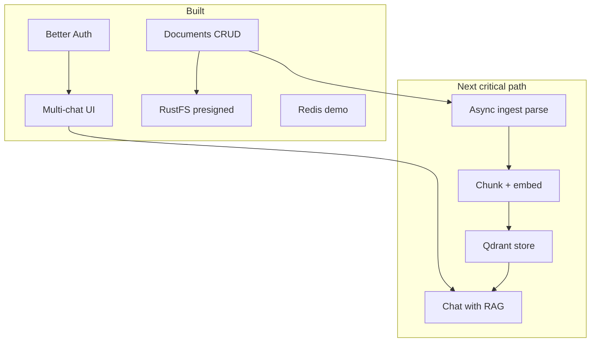

# Documind roadmap (app-focused)

This plan is for the **Documind application** (`../documind`), not this docs site. Use it to decide the next engineering investment.

**How to use this page:** pick an option ID under [Choose what to do next](#choose-what-to-do-next) (e.g. `A`, `B1`, `C`) and implement that slice.

---

## 1. Product north star

**Documind** should become: *upload text documents → ask questions grounded in those documents → keep multi-chat history with ownership and durable storage.*

Today we have the **shell + storage + multi-chat UX**. We do **not** yet ground answers in file content (no parse / embed / retrieve / LLM).



---

## 2. Current system (as-is)

| Area | Status | Notes |
|------|--------|--------|
| Marketing + theme | Done | Landing, dark/light |
| Auth (email/password) | Done | Better Auth + Postgres |
| Multi-chat | Done | `/new`, `/c/[id]`, rename, delete |
| Chat messages | Partial | Persisted; **assistant is placeholder** |
| Document upload | Done | Chat + My documents; allow-list |
| Document ownership | Done | Owner-only APIs |
| RustFS (S3) | Done | Presign PUT/GET/DELETE |
| Redis | Demo only | CRUD playground; not used as job queue |
| Qdrant | Infra only | In compose; **not used by app code** |
| Document ingest pipeline | **Option A done** | Queue + worker + statuses; no full parse/RAG yet |
| Document parsing | Stub only | Text probe for txt/md/csv; full parse = B/F |
| RAG / embeddings | Not started | — |
| LLM integration | Not started | — |
| Production hardening | Thin | Secrets, rate limits, observability |
| Dashboard (`/dashboard`) | Legacy | shadcn demo; not core product |

### Data already modeled

- Auth tables, `documents`, `chats`, `chat_messages`, `chat_message_documents`
- Document statuses: `pending` | `ready` | `failed` (file storage only)

### Infra already running (Docker)

Postgres, Redis, RustFS, Qdrant — enough to start the **ingest + RAG** path without new containers (except optionally a worker process).

---

## 3. Architectural principles (keep these)

1. **Upload stays fast** — never parse large PDFs inside the Next request that handles browser upload.
2. **Owner isolation** — every read/write filters `userId`; no cross-user leakage.
3. **Async ingestion** — Redis (or similar) queue + worker for extract → chunk → embed.
4. **Retrieval before generation** — chat answers should use Qdrant (or equivalent) with `userId` + `documentId` filters.
5. **Docs stay separate** — product code in `documind`; docs in `documind-docs`.
6. **ADRs for big choices** — model provider, worker language (Node vs Python for PDF), embed model.

---

## 4. Target architecture (to-be)

```text
Browser
  → Next.js (UI + thin APIs)
      → Postgres (users, chats, documents, jobs metadata)
      → RustFS (bytes)
      → Redis (job queue)
  → (presigned) RustFS upload/download

Worker (new process or container)
  → pop job
  → GET object from RustFS
  → parse by type (txt/md/csv/docx/xlsx/pdf…)
  → chunk
  → embed
  → upsert Qdrant points { userId, documentId, chunkIndex, text }

Chat send
  → embed query
  → Qdrant search (filter userId + selected documentIds)
  → LLM with citations
  → persist assistant message
```

Suggested new document statuses (when ingest lands):

| Status | Meaning |
|--------|---------|
| `pending` | Presign created / upload not confirmed |
| `ready` | Object in RustFS confirmed |
| `processing` | Ingest job running |
| `indexed` | Searchable in Qdrant |
| `failed` | Upload or ingest failed (store reason) |

---

## 5. Work backlog (prioritized)

### P0 — Correctness & product clarity (short)

| ID | Item | Why |
|----|------|-----|
| P0.1 | Remove or hide legacy **Dashboard** from product mental model | Reduces confusion |
| P0.2 | Document status UX (`processing` / `indexed`) when ingest starts | Users know when files are usable in chat |
| P0.3 | Rate-limit / harden presign + chat create | Abuse protection before public deploy |
| P0.4 | Production env checklist (secrets, HTTPS, CORS, Redis AUTH) | Local compose ≠ production |

### P1 — Document intelligence core (main path)

| ID | Item | Why |
|----|------|-----|
| **P1.1** | **Ingest job model** (table or Redis stream) after document `ready` | Foundation for all AI features |
| **P1.2** | **Worker process** (start Node; PDF may move to Python/PyMuPDF later) | Keep Next free of heavy CPU |
| **P1.3** | **Parsers by type** (txt/md/csv/docx/xlsx first; PDF next) | Unlock content |
| **P1.4** | **Chunking** strategy + store chunks (Postgres and/or Qdrant payload) | Retrieval quality |
| **P1.5** | **Embeddings + Qdrant** upsert with ownership filters | RAG store |
| **P1.6** | **Chat RAG** — replace placeholder assistant with retrieve + LLM | Product value |
| **P1.7** | **Citations UI** (which doc/chunk answered) | Trust |

### P2 — Chat product depth

| ID | Item | Why |
|----|------|-----|
| P2.1 | Stream assistant tokens | UX parity with ChatGPT/Claude |
| P2.2 | Stop / regenerate | Expected chat controls |
| P2.3 | Per-chat document scope (only attached docs vs all user docs) | Control context |
| P2.4 | Soft-delete / archive chats | Safer history |
| P2.5 | Editable profile (name) beyond read-only settings | Account completeness |

### P3 — Platform & ops

| ID | Item | Why |
|----|------|-----|
| P3.1 | App deploy (Vercel/Fly/etc.) + managed Postgres/S3/Redis | Real users |
| P3.2 | Observability (logs, traces, upload/ingest metrics) | Debug production |
| P3.3 | E2E tests (auth, upload, chat create) | Regression safety |
| P3.4 | Virus/malware scanning optional for uploads | Enterprise readiness |
| P3.5 | Multi-tenant org/teams (if needed) | B2B |

### P4 — Explicit non-goals (for now)

- Real-time multiplayer editing of documents  
- Image/video as primary knowledge sources  
- Parsing on the hot upload path  
- Building a general-purpose LLM playground unrelated to documents  

---

## 6. Suggested sequencing (dependency order)

```text
P1.1 Job model
  → P1.2 Worker
    → P1.3 Parsers (text suite first)
      → P1.4 Chunking
        → P1.5 Qdrant + embeddings
          → P1.6 Chat RAG + LLM
            → P1.7 Citations
              → P2.1 Streaming …
```

Do **not** wire the LLM before retrieval works; that produces hallucinated “document answers.”

**Parser performance note (already decided direction):**  
Node parsers for txt/md/csv/docx/xlsx; evaluate **PyMuPDF** (or Tika) for PDF in a worker when PDF quality/speed matters. See product discussions / ADR-0007.

---

## 7. Choose what to do next

Pick **one** option and implement that slice end-to-end before starting another.

### Option A — **Ingest foundation** ✅ Implemented

**Shipped:** `document_jobs` + Redis queue + `npm run worker:ingest` + statuses `processing` / `indexed` / `failed` + UI badges + reprocess.

**Out of scope for A (still open):** LLM answers, Qdrant, full PDF parse.

**Exit criteria:** after upload, a worker marks the document indexed (or failed) without blocking upload API.

**Explain this stage in plain language:** [Document ingest (Option A)](/docs/guide/document-ingest)

---

### Option B — **Text-first RAG MVP** (fastest path to real Q&A)

**Ship:** parse **txt/md/csv** only + chunk + embed + Qdrant + chat uses retrieval for those types.

**Out of scope for B:** PDF/DOCX excellence (add later).

**Exit criteria:** attach a `.txt` or `.md`, ask a question, get an answer grounded in that file with a basic citation.

**Sub-options:**

| ID | Focus |
|----|--------|
| **B1** | Parse + store plain text in Postgres only (no vectors) — simpler, weaker search |
| **B2** | Parse + embed + Qdrant (recommended) |
| **B3** | B2 + OpenAI/Anthropic/xAI streaming UI |

---

### Option C — **LLM chat only (no RAG)**

**Ship:** replace placeholder assistant with a real model; ignore document bytes.

**Exit criteria:** multi-turn chat works with streaming.

**Risk:** users will think documents are used when they are not — label UI clearly. Prefer A/B for Documind’s north star.

---

### Option D — **Production hardening**

**Ship:** env validation, rate limits, Redis AUTH for non-local, S3 production config, remove Redis demo from main nav (or gate behind `NODE_ENV=development`), error budgets, deploy app.

**Exit criteria:** checklist-based production deploy of current features.

---

### Option E — **UX polish (no AI)**

**Ship:** streaming UI shell, better empty states, dashboard removal, document search filter, mobile sidebar polish, profile edit.

**Exit criteria:** product feels finished as a **document locker + multi-chat shell**.

---

### Option F — **PDF-capable ingest**

**Ship:** dedicated PDF pipeline (PyMuPDF worker or Tika) after A exists.

**Depends on:** Option A.

**Exit criteria:** PDF upload → indexed → retrievable chunks with page metadata.

---

### Option G — **Docs / ops only**

**Ship:** publish `documind-docs` to Vercel; keep app backlog frozen.

**Exit criteria:** public docs URL linked from app README.

---

## 8. Decision matrix (quick)

| If you want… | Choose |
|--------------|--------|
| Real “chat with my files” soon | **A** then **B2** (then **B3**) |
| Demo of AI chat this week | **C** (temporary) or **B3** if text files only |
| Ship current product safely | **D** |
| Looks polished without AI | **E** |
| PDF quality | **A** then **F** |
| Public documentation | **G** |

**Architect recommendation for Documind:**  
**A → B2 → B3 → F → D**, with **E** interleaved as small PRs.

---

## 9. Definition of done for “v1 document intelligence”

- [ ] Upload text docs (current allow-list)  
- [ ] Async ingest; status visible  
- [ ] Vectors in Qdrant with `userId` filter  
- [ ] Chat uses only the user’s (selected) documents  
- [ ] Placeholder assistant removed for RAG path  
- [ ] Failures visible and retriable  
- [ ] ADRs updated for model + embed provider  

---

## 10. How to request work from this plan

Reply with one of:

- `Do A` — ingest foundation  
- `Do B2` — text RAG MVP  
- `Do B3` — RAG + streaming LLM  
- `Do C` — LLM without RAG  
- `Do D` — production hardening  
- `Do E` — UX polish  
- `Do F` — PDF ingest (after A)  
- `Do G` — deploy docs to Vercel  
- Or a custom mix, e.g. `Do A + B2`  

Work lands in the **`documind`** app repo unless the option is docs-only (**G**).

---

## 11. Related docs

- [Architecture overview](/docs/architecture/overview)  
- [Documents product](/docs/product/documents)  
- [Chat product](/docs/product/chat)  
- [ADR-0007 no parse on upload](/docs/adr/0007-no-parse-on-upload)  
- [Deploy documentation](/docs/development/deploy-docs)  
