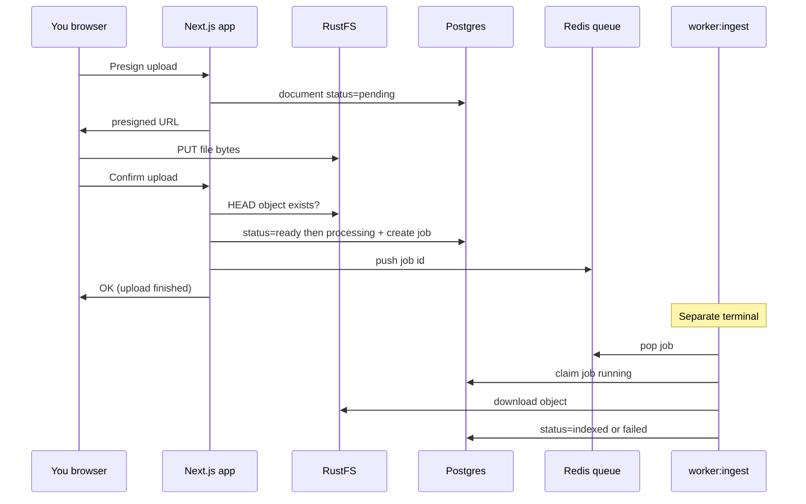

# Document ingest explained

This page explains **what we built in “Option A”** and why you need a separate command `npm run worker:ingest`. If chat chips only show “uploaded” but **My documents** shows `processing` → `indexed`, this is why.

---

## The simple picture

Think of three separate steps when you add a file:

```text
1. UPLOAD     →  “Save the file somewhere safe”
2. INGEST     →  “Prepare that file for future intelligence features”
3. CHAT / AI  →  “Answer questions using the prepared content”  (not built yet)
```

| Step | What the user sees | What the system does |
|------|--------------------|----------------------|
| **Upload** | Progress / “done” chip in chat; file appears in My documents | Browser puts the file in **RustFS** (S3 storage). Postgres stores name, owner, path. |
| **Ingest** | Status badge: `processing` → `indexed` (on **My documents**) | A **background worker** checks the file is readable and marks it ready for later AI work. |
| **Chat with docs** | Real answers from the file | Parse text, search, LLM — **not in this stage** |

**Ingest** is step 2. It is **not** the same as upload, and it is **not** yet “AI reading your PDF.”

---

## What “ingest” means here

**Ingest** = a **background job** that runs **after** the file is successfully stored.

In Option A (current stage), ingest is intentionally **small**:

1. Take a job for a document  
2. Download the object from RustFS (server credentials)  
3. Verify the object is not empty  
4. For simple text files (`.txt`, `.md`, `.csv`), check UTF-8 content is not empty  
5. Mark the document **`indexed`** if OK, or **`failed`** if not  

It does **not** yet:

- Fully parse PDF / Word / Excel into searchable text  
- Create embeddings  
- Put anything in Qdrant  
- Change what the chat assistant says (still a **placeholder** reply)

So if you ask “what did we achieve?”:

> We built a **reliable pipeline** so every uploaded file can be processed **asynchronously**, with clear statuses and retries — the foundation for “chat with my documents” later.

---

## Why not do this during upload?

When you click upload (or attach in chat), the browser:

1. Asks the app for a **presigned URL**  
2. **Uploads the file directly to RustFS**  
3. Calls **confirm** so the app marks the file as stored  

That path must stay **fast and reliable**. Heavy work (PDF parsing, OCR, embeddings) can take **seconds to minutes**. If we did that inside the upload API:

- The browser would hang  
- Timeouts and failed uploads would increase  
- The Next.js server would be busy with CPU work instead of serving the UI  

So we split:

```text
Upload request  →  only “file is in storage”
Worker process  →  “prepare / validate for later AI”
```

That split is **Option A**.

---

## What `npm run worker:ingest` does

The app (`npm run dev`) and the **worker** are **two different programs**.

| Process | Command | Role |
|---------|---------|------|
| **Web app** | `npm run dev` | UI, auth, APIs, create jobs when upload confirms |
| **Ingest worker** | `npm run worker:ingest` | Long-running loop that **claims jobs** and processes documents |

### Worker loop (plain language)

```text
forever:
  1. Ask Redis/Postgres: “Is there an ingest job waiting?”
  2. If none → sleep ~1.5s → try again
  3. If yes → mark job “running”
  4. Load document metadata (owner, S3 key)
  5. Download file from RustFS
  6. Run Option A checks (readable / not empty)
  7. Mark document indexed OR failed
  8. Go back to step 1
```

If you **never** start the worker:

- Uploads still succeed (file is in RustFS)  
- Jobs may sit as **queued** / documents as **processing**  
- Status **never** becomes **`indexed`**  

So the worker is **required** to complete Option A, just like Docker is required for Postgres.

---

## Document statuses (what the badges mean)

| Status | Meaning |
|--------|---------|
| **`pending`** | Upload slot created; file not confirmed in storage yet |
| **`ready`** | File confirmed in RustFS (bytes are there) |
| **`processing`** | Ingest job is queued or running |
| **`indexed`** | Ingest finished successfully (pipeline OK for this stage) |
| **`failed`** | Ingest failed (see error message); can **Retry ingest** |

### Important: chat chip vs My documents

| Place | What you see after attach/upload |
|-------|----------------------------------|
| **Chat attachment chip** | Only **upload** state: uploading → done/error. It does **not** show `processing` / `indexed` today. |
| **My documents** | Full lifecycle badges + polling + **Retry ingest**. **This is where you verify Option A.** |

So: uploading in chat and seeing a normal “file attached” chip is **correct**.  
To see ingest, open **My documents** (or wait for poll) and watch the badge.

---

## How the pieces connect



---

## Why this stage is important

Even though chat is not “smart” yet, Option A is the backbone of Documind’s product direction:

1. **Foundation for RAG** — later steps (parse → chunk → embed → Qdrant → LLM) plug into this worker and these statuses.  
2. **Retries** — if processing fails, you can re-run without re-uploading.  
3. **Honest UX** — users can eventually see “still processing” vs “ready for chat.”  
4. **Keeps the web app healthy** — heavy work stays off the request path.  
5. **Uses infra you already have** — Redis queue + Postgres job rows + RustFS download.

Skipping this and jumping straight to “call an LLM” would either:

- ignore the files, or  
- block uploads on heavy work, or  
- build one-off scripts that are hard to run in production  

---

## How to run and test (checklist)

### Terminals

```bash
# 1) Infrastructure
docker compose up -d

# 2) App
npm run dev

# 3) Worker (required for indexed)
npm run worker:ingest
```

### Happy path

1. Sign in → **My documents**  
2. **Upload** a small `.txt` or `.md` file with some text  
3. Badge should move: **processing** → **indexed**  
4. Worker logs should show `claimed` then `indexed`  

### Upload from chat

1. **New chat** → attach a file → chip shows upload complete  
2. Open **My documents** → same file should progress to **indexed**  
3. Chat reply is still a **placeholder** — that is expected  

### Without the worker

1. Stop `worker:ingest`  
2. Upload a file  
3. Status may stay **processing**  
4. Start the worker again (or click **Retry ingest**) → should become **indexed**  

---

## What comes after this stage

| Stage | Goal |
|-------|------|
| **A (done)** | Pipeline: queue + worker + statuses |
| **B** | Parse text + embeddings + Qdrant search |
| **Then** | Real answers from documents + citations |

Until B, **`indexed` means “ingest pipeline succeeded,” not “AI has fully understood this PDF.”**

---

## Related pages

- [Documents (product)](/docs/product/documents)  
- [Local development](/docs/guide/local-development)  
- [Docker services](/docs/guide/docker)  
- [Roadmap](/docs/development/roadmap)  
- [ADR-0007: No parse on upload](/docs/adr/0007-no-parse-on-upload)  
