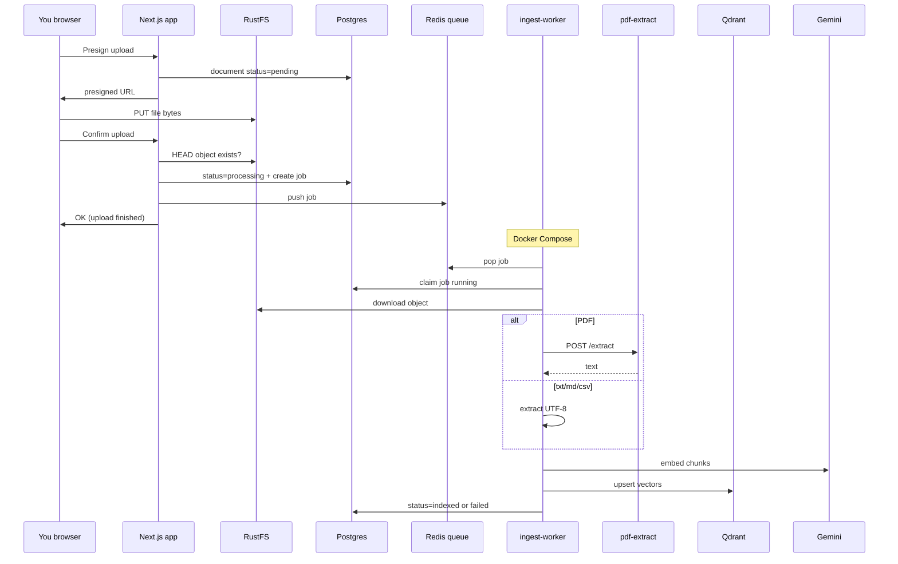

# Document ingest explained

This page explains **what ingest is**, **why it exists**, and how it connects to chat.

For PDF details: [PDF extract (F1)](/docs/guide/pdf-extract).  
For embeddings / Qdrant: [Embeddings & Qdrant](/docs/guide/embeddings-and-qdrant).  
For grounded answers: [RAG chat](/docs/guide/rag-chat).

---

## The simple picture

```text
1. UPLOAD     →  Save the file in RustFS (fast, browser → S3)
2. INGEST     →  Prepare that file for search / AI
3. CHAT / AI  →  Answer questions using prepared content
```

| Step | What the user sees | What the system does |
|------|--------------------|----------------------|
| **Upload** | Progress / “done” chip; file on My documents | Browser puts the file in **RustFS**. Postgres stores name, owner, path. |
| **Ingest** | Badge: `processing` → `indexed` (or `failed`) | **Docker `ingest-worker`** extracts text, embeds, upserts **Qdrant**. |
| **Chat with docs** | Streaming answers | Retrieval + model — **indexed** docs **pinned to the chat**. |

**Ingest is not upload.** Upload finishes when bytes are in storage. Ingest finishes when the pipeline has prepared (or failed) the file for RAG.

---

## How to run (daily)

```bash
docker compose up -d   # postgres, redis, qdrant, rustfs, pdf-extract, ingest-worker
npm run dev            # Next.js app only
```

You do **not** need a separate terminal for ingest. The Compose service **`ingest-worker`** claims jobs automatically.

---

## What gets text for RAG

| Format | Extractor | Chat/RAG when indexed |
|--------|-----------|------------------------|
| `.txt`, `.md`, `.csv`, `.rtf` | Node (UTF-8) | Yes |
| **Text-based PDF** (selectable text) | Docker **`pdf-extract`** (PyMuPDF) | Yes |
| Scanned / image-only PDF | Native extract empty | **`failed`** until OCR (F1b) |
| DOCX / XLSX (binary) | Not fully extracted yet | Storage only / no vectors |

---

## Why not parse during upload?

Upload must stay **fast**: presign → browser PUT → confirm → **enqueue job**.  
Heavy work (PDF, embeddings) runs in the **background worker**.

```text
Upload request  →  “file is in storage” + enqueue job
ingest-worker   →  extract → embed → Qdrant → indexed | failed
```

---

## What the Docker ingest worker does

| Process | How it runs | Role |
|---------|-------------|------|
| **Web app** | `npm run dev` | UI, auth, APIs, create jobs on confirm |
| **ingest-worker** | Compose service | Claims jobs; extract → embed → Qdrant |
| **pdf-extract** | Compose service `:8090` | PDF → plain text (PyMuPDF) |

### Worker loop

```text
forever:
  1. Claim next job (Redis pop, or Postgres queued/stale)
  2. Load document (owner, S3 key)
  3. Download bytes from RustFS
  4. Extract text (Node for text files; HTTP to pdf-extract for PDF)
  5. If text: chunk → embed → upsert Qdrant
  6. Mark document indexed OR failed
  7. Loop
```

If Compose is **not** running:

- Uploads may still succeed  
- Documents may stay **`processing`**  
- Chat library shows **no indexed files**  

---

## Document statuses

| Status | Meaning |
|--------|---------|
| **`pending`** | Presign created; not confirmed in storage |
| **`ready`** | File confirmed in RustFS (usually brief) |
| **`processing`** | Ingest job queued or running |
| **`indexed`** | Ingest succeeded (vectors if text was extractable) |
| **`failed`** | Ingest failed (empty PDF text, embed error, …); use **Retry ingest** |

### Chat chip vs My documents

| Place | After attach/upload |
|-------|---------------------|
| **Chat attachment chip** | Upload only: uploading → done/error |
| **My documents** | Full lifecycle + polling + retry |
| **In this chat** | Pinned docs for RAG every turn |

---

## How the pieces connect



---

## Happy path (text PDF or .txt)

1. `docker compose up -d` + `npm run dev`  
2. **My documents** → upload a text PDF or `.txt`  
3. Badge: **processing** → **indexed**  
4. **New chat** → pin file under **In this chat** / library  
5. Ask a question → streamed answer from RAG  

### Scanned PDF

1. Upload image-only PDF  
2. Status **`failed`** with message about no extractable text  
3. OCR path (F1b) will use the same `pdf-extract` service later  

---

## Stages

| Stage | Goal | Status |
|-------|------|--------|
| **A** | Queue + worker + statuses | Done (worker in Docker) |
| **B2+B3** | Text extract → embed → Qdrant → streaming chat | Done |
| **F1** | Text-based PDF via PyMuPDF | Done |
| **F1b** | OCR for scanned PDFs | Next |
| **S** | Sources footer | After F1b / as polish |

---

## Related pages

- [PDF extract (F1)](/docs/guide/pdf-extract)  
- [Embeddings, Qdrant & Gemini stack](/docs/guide/embeddings-and-qdrant)  
- [RAG chat](/docs/guide/rag-chat)  
- [Docker services](/docs/guide/docker)  
- [Local development](/docs/guide/local-development)  
