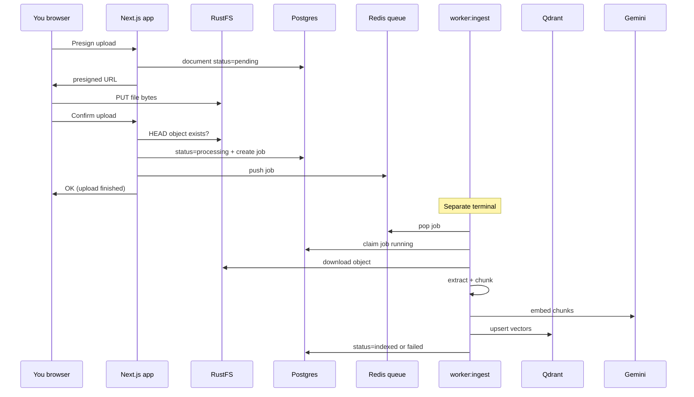

# Document ingest explained

This page explains **what ingest is**, **why it exists**, and how it connects to chat. Upload chips only show “stored”; **My documents** shows `processing` → `indexed`.

For grounded answers (Gemini + Qdrant + streaming), see **[RAG chat (B2 + B3)](/docs/guide/rag-chat)**.

---

## The simple picture

```text
1. UPLOAD     →  “Save the file somewhere safe”
2. INGEST     →  “Prepare that file for search / AI”
3. CHAT / AI  →  “Answer questions using prepared content”
```

| Step | What the user sees | What the system does |
|------|--------------------|----------------------|
| **Upload** | Progress / “done” chip in chat; file on My documents | Browser puts the file in **RustFS**. Postgres stores name, owner, path. |
| **Ingest** | Badge: `processing` → `indexed` (My documents) | **Background worker** downloads the object, extracts text when possible, embeds, upserts **Qdrant**, updates status. |
| **Chat with docs** | Streaming answers | Retrieval + Gemini — only for **indexed** docs **attached on that turn**. |

**Ingest is not upload.** Upload finishes when bytes are in storage. Ingest finishes when the pipeline has prepared (or failed) the file for RAG.

---

## What we built (history)

### Option A — foundation

We first shipped a **reliable async pipeline** without full AI:

- Job rows (`document_jobs`) + Redis list queue  
- Separate process `npm run worker:ingest`  
- Statuses: `processing` | `indexed` | `failed`  
- My documents badges + **Retry ingest**  

**Why A first:** prove enqueue → claim → succeed/fail/retry without blocking the browser. That is the spine everything else hangs on.

### Option B2 — intelligence inside the same worker

The **same worker** now does real prep for text files:

1. Download object from RustFS  
2. Extract plain text (`.txt` / `.md` / `.csv`)  
3. Chunk with overlap  
4. Embed with **Gemini**  
5. Upsert **Qdrant** points (with `userId` + `documentId`)  
6. Mark **`indexed`** or **`failed`**

**Why inside the worker (not on upload):** large files and embedding rate limits can take seconds–minutes. ADR-0007: keep upload fast.

**Why not PDF yet:** binary parsers are a separate investment (Option **F**). Text files prove upload → vectors → answers end-to-end.

---

## Why not do ingest during upload?

When you attach or upload, the browser:

1. Asks the app for a **presigned URL**  
2. **Uploads directly to RustFS**  
3. Calls **confirm** so the app marks storage OK and **enqueues** a job  

That path must stay **fast and reliable**. If we embedded or parsed PDF inside confirm:

- The browser would hang  
- Timeouts would rise  
- Next.js would burn CPU on request threads  

```text
Upload request  →  only “file is in storage” (+ enqueue job)
Worker process  →  “extract / embed / index for AI”
```

---

## What `npm run worker:ingest` does

| Process | Command | Role |
|---------|---------|------|
| **Web app** | `npm run dev` | UI, auth, APIs, create jobs on confirm |
| **Ingest worker** | `npm run worker:ingest` | Claims jobs; extract → embed → Qdrant |

### Worker loop

```text
forever:
  1. Claim next job (Redis pop, or Postgres queued/stale)
  2. Load document (owner, S3 key)
  3. Download bytes from RustFS
  4. Extract text if type supported
  5. If text: chunk → embed → upsert Qdrant
  6. Mark document indexed OR failed (retry until max attempts)
  7. Loop
```

If you **never** start the worker:

- Uploads still succeed  
- Documents may sit at **`processing`**  
- Chat library shows **no indexed files**  
- RAG cannot use those files  

---

## Document statuses

| Status | Meaning |
|--------|---------|
| **`pending`** | Presign created; not confirmed in storage |
| **`ready`** | File confirmed in RustFS (usually brief) |
| **`processing`** | Ingest job queued or running |
| **`indexed`** | Ingest succeeded (vectors if text was extractable) |
| **`failed`** | Ingest failed; use **Retry ingest** |

### Chat chip vs My documents

| Place | After attach/upload |
|-------|---------------------|
| **Chat attachment chip** | Upload only: uploading → done/error |
| **My documents** | Full lifecycle + polling + retry |

That split is intentional: chat stays snappy; My documents is the pipeline dashboard.

### What “indexed” means for chat

- **txt/md/csv with content** → searchable in Qdrant → good RAG candidates  
- **PDF/Word without parsers yet** → may be `indexed` for storage, but **no chunks** → answers cannot quote the file  
- Prefer text files until Option **F**

---

## How the pieces connect



---

## Why this design matters

1. **Foundation for RAG** — chat only works well when ingest filled Qdrant.  
2. **Retries** — reprocess without re-uploading.  
3. **Honest UX** — processing vs indexed vs failed.  
4. **Healthy web app** — heavy work off the request path.  
5. **Reuse of infra** — Redis + Postgres jobs + RustFS + Qdrant + Gemini.

Skipping the worker and calling an LLM on raw S3 keys would either ignore files, block uploads, or create unmaintainable one-offs.

---

## How to run and test

```bash
# 1) Infrastructure (includes Qdrant on 6335)
docker compose up -d

# 2) App (.env: GEMINI_API_KEY, QDRANT_URL, …)
npm run dev

# 3) Worker (required for indexed + embeddings)
npm run worker:ingest
```

### Happy path

1. **My documents** → upload a small `.txt` / `.md`  
2. Badge: **processing** → **indexed**  
3. Worker logs: claim + chunk count / success  
4. **New chat** → pick file under **Indexed documents** → ask a question → streamed answer  

### Without the worker

1. Stop `worker:ingest`  
2. Upload → may stick on **processing**  
3. Start worker or **Retry ingest** → **indexed**  

---

## Stages

| Stage | Goal | Status |
|-------|------|--------|
| **A** | Queue + worker + statuses | Done |
| **B2+B3** | Text extract → embed → Qdrant → streaming chat | Done |
| **F** | PDF/DOCX (etc.) parsers | Next product option |
| **D** | Production hardening | Open |

---

## Related pages

- [Embeddings, Qdrant & Gemini stack](/docs/guide/embeddings-and-qdrant) — **what embeddings are**, when to re-ingest  
- [RAG chat (B2+B3) — what & why](/docs/guide/rag-chat)  
- [Documents (product)](/docs/product/documents)  
- [Local development](/docs/guide/local-development)  
- [Docker services](/docs/guide/docker)  
- [Roadmap](/docs/development/roadmap)  
- [ADR-0007: No parse on upload](/docs/adr/0007-no-parse-on-upload)  
- [ADR-0008: Gemini streaming RAG](/docs/adr/0008-gemini-streaming-rag)  
- [ADR-0009: Interactions + embedding-2](/docs/adr/0009-gemini-interactions-embedding-2)  
